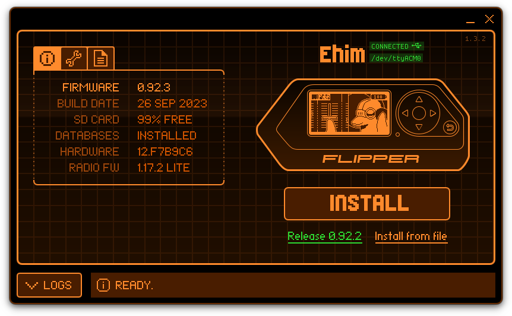
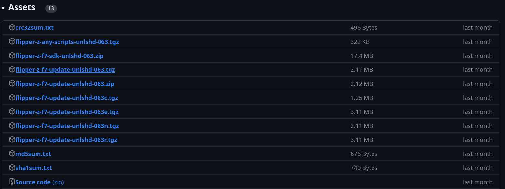
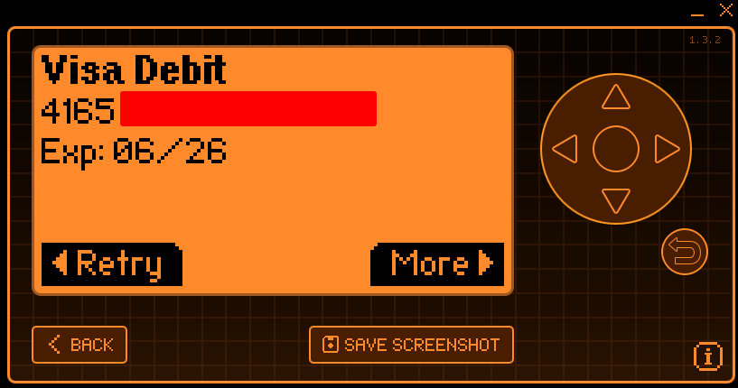
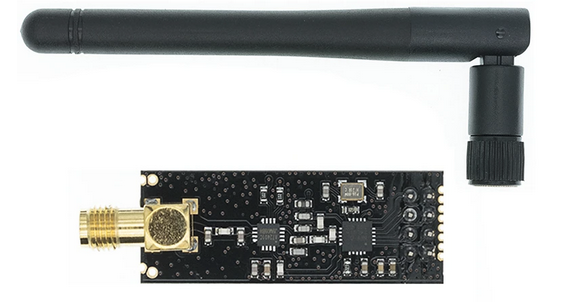
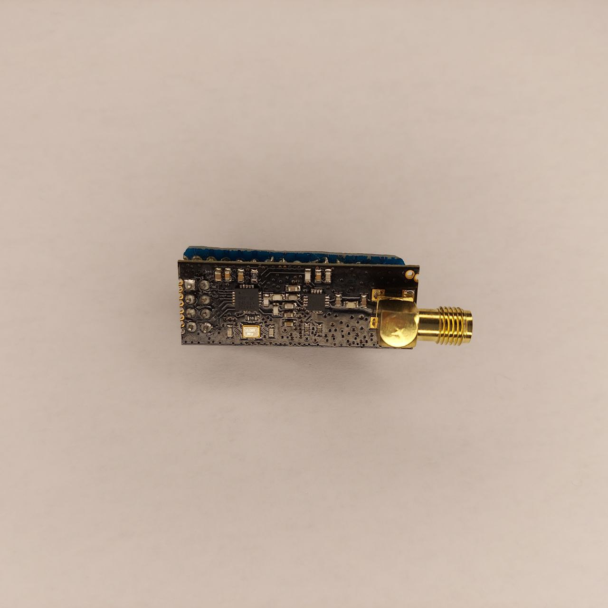
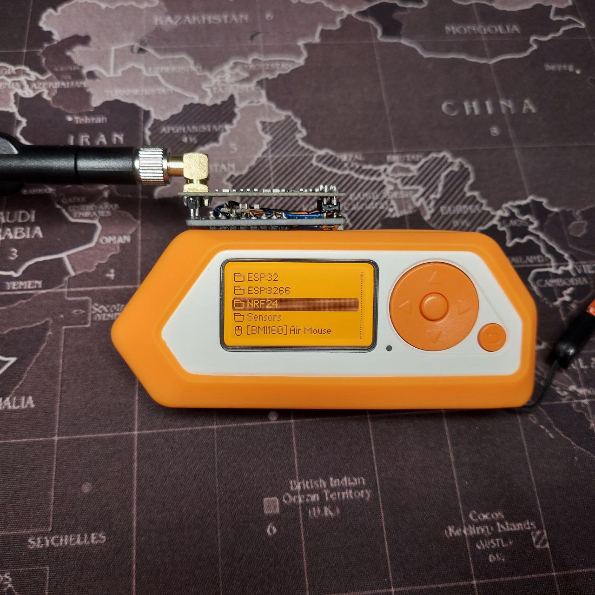
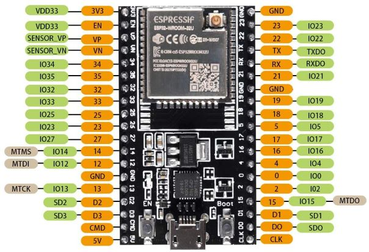
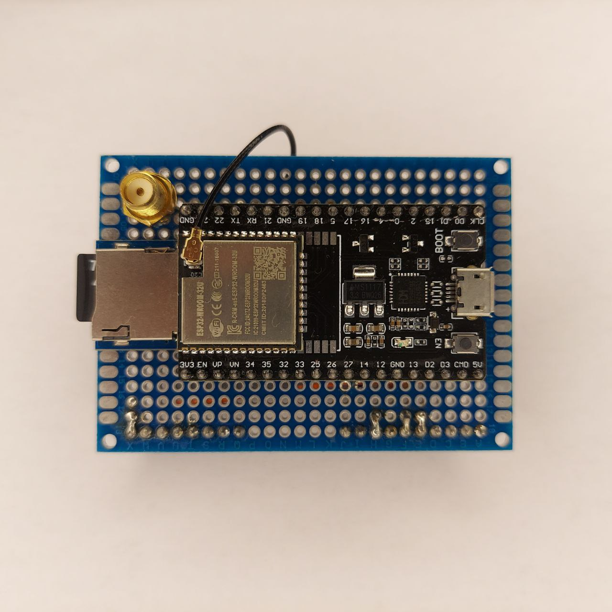
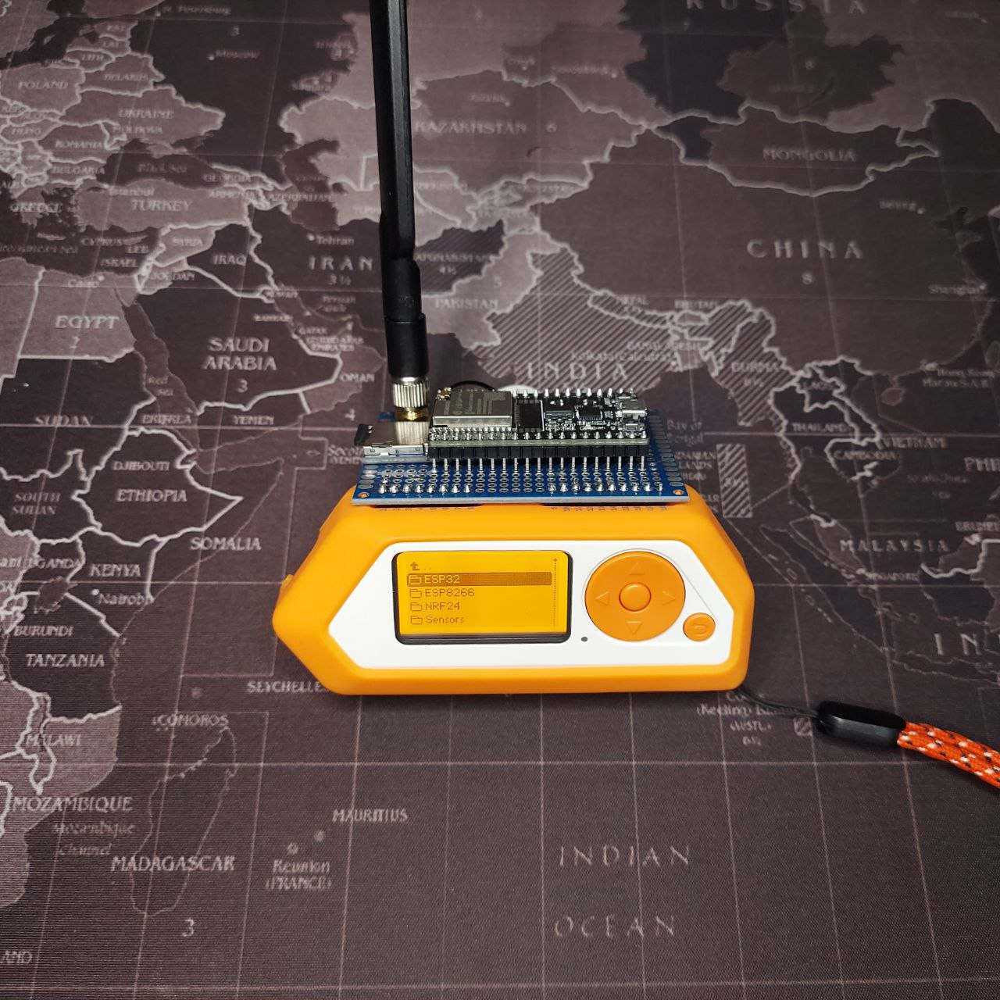
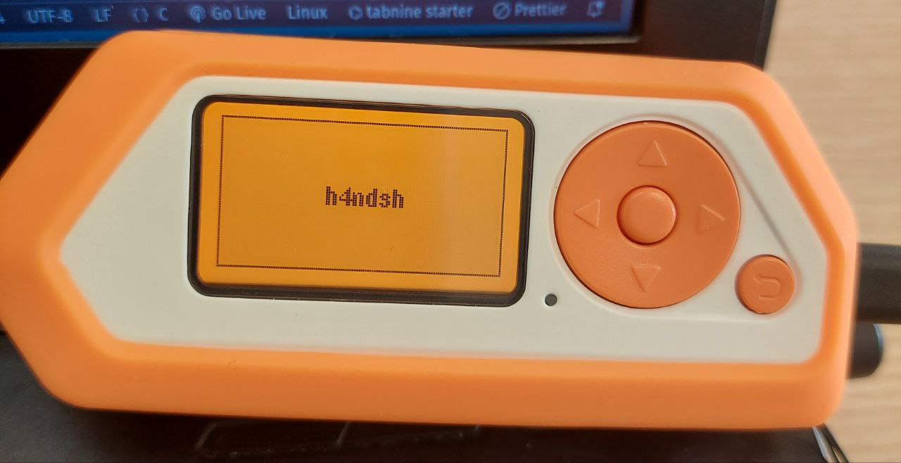

# Exploring the Versatile Flipper Zero: First Impressions and Hands-On


I recently acquired a Flipper Zero, a multi-tool device that can be used for a variety of tasks, including security research, hardware hacking, and DIY electronics. In this blog post, I will share my first impressions of the Flipper Zero, as well as some of the projects I have been working on with it.

I am excited to explore all of the possibilities that the Flipper Zero has to offer. I believe that it is a valuable tool for anyone who is interested in security, hardware, or electronics.

I look forward to sharing my experiences with the Flipper Zero in future blog posts.

# Summary
- [Summary](#summary)
- [Introduction](#introduction)
- [What is a Flipper Zero](#what-is-a-flipper-zero)
- [💸 Why buy a Flipper Zero?](#-why-buy-a-flipper-zero)
- [🏁 First Steps](#-first-steps)
  - [Installing Flipper Zero Firmware Update](#installing-flipper-zero-firmware-update)
  - [Installing New Firmware](#installing-new-firmware)
- [➡️ Let's Get Started](#️-lets-get-started)
    - [NFC](#nfc)
- [🔨 Building GPIO modules](#-building-gpio-modules)
  - [NRF24L01](#nrf24l01)
    - [Connection with Flipper Zero](#connection-with-flipper-zero)
      - [Connect NRF24L01 board with Flipper Zero](#connect-nrf24l01-board-with-flipper-zero)
  - [ESP32-WROOM](#esp32-wroom)
    - [Connection with Flipper Zero](#connection-with-flipper-zero-1)
      - [Connect ESP32-WROOM-32U to Flipper Zero](#connect-esp32-wroom-32u-to-flipper-zero)
      - [Connect Micro SD TF Module to ESP32-WROOM-32U](#connect-micro-sd-tf-module-to-esp32-wroom-32u)
      - [Install Marauder on ESP32-WROOM](#install-marauder-on-esp32-wroom)
- [🤞 First Plugin](#-first-plugin)
- [References](#references)


# Introduction

In the realm of security research, hardware hacking, and DIY electronics, the Flipper Zero has emerged as a versatile and indispensable tool. In this blog post, penned by the enthusiastic h4ndsh, we'll embark on a journey to discover the Flipper Zero's capabilities through their first-hand experiences. From the initial setup to exploring NFC capabilities and expanding its functionalities, this post promises to be an insightful guide for both beginners and seasoned hackers alike. So, let's delve into the world of the Flipper Zero and see how it can revolutionize your security and electronics endeavors. Happy hacking! 🐬💻🔐

# What is a Flipper Zero

The Flipper Zero does not need presentations. It is already a fairly well-known equipment for good and bad reasons. For those who are reading this post and have never heard of this equipment, the Flipper Zero is an open-source security and ethical hacking equipment, designed for security testing, protocol analysis, and software development activities.

# 💸 Why buy a Flipper Zero?

The Flipper Zero is a versatile tool that can be used for a variety of purposes, including hacking. It is a popular choice for beginners because it is relatively inexpensive and easy to use, but it is also a powerful tool that can be used by experienced hackers to perform complex attacks.

- It is a multi-tool device: The Flipper Zero can be used to interact with a wide variety of devices and protocols, including `NFC`, `RFID`, `IR`, and `sub-GHz` wireless. This makes it a great tool for learning about different hacking techniques and how they work.
  
- It is open source: The Flipper Zero is open source, which means that the code and hardware are freely available for anyone to inspect and modify. This makes it a great tool for learning about how hacking tools work and how to develop your own.
  
- It is customizable: The Flipper Zero is highly customizable, with a variety of add-on boards and accessories available. This makes it a great tool for learning about hardware and electronics, and for developing your own custom hacking tools.

The Flipper Zero has gained popularity not only for its hacking capabilities but also as an educational tool for exploring hardware knowledge.

Apart from its specific features tailored for hacking activities, the Flipper Zero's appeal among enthusiasts extends to its role in hardware learning. Its versatility allows users to delve into the intricacies of hardware components, gaining hands-on experience with various electronic systems.

The device's educational value stems from its user-friendly interface and extensive documentation, making it accessible to beginners and experienced tinkerers alike. The Flipper Zero's open-source nature fosters a vibrant community of developers who continuously create and share new tools and resources, further enriching the learning experience.


# 🏁 First Steps

Experimenting with the tools that come with the official software is definitely a great start, but I also want to explore adding new modules to the GPIO. To experiment, I installed a community-developed firmware.

## Installing Flipper Zero Firmware Update

First, we need to download the software that communicates with the Flipper Zero via USB. To do this, download from [flipperzero.one](https://flipperzero.one/update). I'm using Linux, the chosen version should be the Linux one. It is also possible to install it on an iPhone or an Android smartphone (via Bluetooth).

 


```bash
mv qFlipper-x86_64-1.3.2.AppImage /usr/bin/flipper
chmod +x /usr/bin/flipper
which flipper
```

To start the program, superuser permission `sudo` may be necessary depending on the circumstances.

```bash
sudo flipper
```



## Installing New Firmware

The provided firmware is sufficient for any type of study, but let's install a firmware developed by the Flipper Zero community that offers many more tools and plugins.

There are several forks of the Flipper Zero firmware. Here are some examples:

| Repository Name | Description |
|---------------------|-----------|----------|
| [Xtreme-Firmware](https://github.com/Flipper-XFW/Xtreme-Firmware) | This firmware is a complete overhaul of the Official Firmware, and also features lots of awesome code-bits from Unleashed. |
| [Unleashed-Firmware](https://github.com/DarkFlippers/unleashed-firmware) | Most stable custom firmware focused on new features and improvements of original firmware components, with almost no UI changes. |
| [RogueMaster](https://github.com/RogueMaster/flipperzero-firmware-wPlugins) | This firmware is a fork of Unleashed and the main Flipper Devices FW! We are NOT paywalled. I will try to keep active development and updates from both in this build along with any other projects that can be found to be useful to the community. I try to keep this FW build the most cutting edge with updates from both and updates from nearly all active community projects. See the RM Games and Plugins for a list of most of those projects. |

To get started, we need to download the firmware. In this case, I will use [unleashed-firmware](https://github.com/DarkFlippers/unleashed-firmware). I will download version `flipper-z-f7-update-unlshd-063.tgz`.  



With the firmware downloaded, simply access the firmware update option, click on `Install from file` and select the file `flipper-z-f7-update-unlshd-063.tgz`, ensuring that the Flipper Zero is already connected to the computer.


# ➡️ Let's Get Started

With everything set up, let's get started!

### NFC

The first attempt I made was to read an NFC card.

NFC (Near Field Communication) is a short-range wireless technology that allows devices to exchange data quickly and easily. It works by creating a magnetic field around two devices when they are brought close together, typically within 10 centimeters. This magnetic field can then be used to transmit data between the two devices.



NFC is used in a variety of applications, including:

- Mobile payments
- Transit passes
- Access control
- Data sharing

NFC is a versatile and convenient technology that is becoming increasingly common in a variety of applications.
Overall, NFC is a powerful and versatile technology that has a wide range of potential applications.

# 🔨 Building GPIO modules

The development of GPIO modules for the Flipper Zero is a creative endeavor that involves designing, creating, and implementing novel functionalities. This process encompasses a wide range of activities, from devising innovative attacks to crafting new hardware boards and exploring diverse applications. It encourages ingenuity in utilizing the GPIO (General Purpose Input/Output) capabilities of the Flipper Zero for both practical and experimental purposes, expanding the device's capabilities and fostering a community-driven approach to innovation.

---

## NRF24L01



The nRF24L01+PA+LNA 2.4GHz RF Wireless Modules are RF transceiver modules that can be used for wireless communications at up to 1100 meters. It's important to note that this module exclusively operates in the 2.4GHz band at data rates of 250Kbps, 1Mbps or 2Mbps. Max operating current is < 115mA. 

The Flipper Zero can communicate with devices at greater distances, which can be useful for applications such as:

- Remote control of remote devices
- Data transmission between devices
- Creating wireless sensor networks

The NRF24L01 can be beneficial in the Flipper Zero for:
- Improving connectivity in areas with potential interference
- Enabling long-range communication with low-power consumption
- Facilitating seamless communication with compatible devices at lower frequencies (below 1GHz)
- Enhancing overall performance for applications that demand extended wireless reach and robust connections.


### Connection with Flipper Zero

Material: 
- 1x PCB Board
- 1x nRF24L01 Board
- 1x DC/DC Buck Converter (1.8V, 3V, 3.7V, or 5V to 3.3V)

In addition to these materials, you will also need some basic soldering equipment, such as a soldering iron, solder, and flux.

#### Connect NRF24L01 board with Flipper Zero

| Flipper Zero | NRF24L01 |
|--------------|-----------------|
| A7   | MOSI |
| A6   | MISO |
| A4   | CSN  |
| B3   | SCK  |
| B2   | CE   |
| GND  | GND  |
| 3V3  | VCC  |
| Left disconnected  | IRQ |

This is my final testing board for Sub GHz with the Flipper Zero.



[Playground Information](https://github.com/UberGuidoZ/Flipper/blob/main/GPIO/ReadMe.md#nrf24l01--mousejack-pinout---8-pin)




---

## ESP32-WROOM

The ESP32-WROOM is a versatile and powerful microcontroller module. A dual-core microcontroller with integrated Wi-Fi and Bluetooth capabilities. This tiny yet potent module serves as a playground for hackers, security researchers, and tinkerers seeking to explore the world of hardware hacking and IoT security.



- `Marauder Attacks`: WiFi attacks via the ESP32 [Marauder](https://github.com/justcallmekoko/ESP32Marauder) involve sending crafted WiFi packets for specific goals. Possible attacks include "Beacon Spam List", "Beacon Spam Random" and "Rick Roll Beacon". These tactics aim to disrupt network discovery and create confusion among nearby devices. Caution is crucial, as unauthorized use of such techniques can be unethical and illegal.

- `Captive Portals`: Hackers can create captive portals with the ESP32 to trick users into connecting to a rogue Wi-Fi network. Once connected, attackers can control the network traffic and potentially launch various exploits.

- `IoT Device Exploitation`: As the IoT ecosystem continues to grow, the ESP32 can be used to audit and assess the security of IoT devices. It can help identify vulnerabilities in smart home devices, industrial systems, and more.

- `Wireless Sniffing and Packet Analysis`: The module's Wi-Fi capabilities make it an excellent tool for monitoring and analyzing wireless networks. It can be used to capture packets, discover network vulnerabilities, and perform Wi-Fi penetration testing.

### Connection with Flipper Zero

Material: 
- 1x PCB Board
- 1x ESP32-WROOM-32U
- 1x Micro SD Card 8GB
- 1x Micro SD TF Module

In addition to these materials, you will also need some basic soldering equipment, such as a soldering iron, solder, and flux.

#### Connect ESP32-WROOM-32U to Flipper Zero

| Flipper Zero | ESP32-WROOM-32U |
|--------------|-----------------|
| TX   | RX |
| RX   | TX |
| GND   | GND  |
| 5V   | 5V  |

#### Connect Micro SD TF Module to ESP32-WROOM-32U

To fully utilize the Marauder project's potential, the integration of a card reader is crucial for enabling network traffic capture (.pcap) and Captive Portal creation. This enhancement will transform the Marauder into a comprehensive network security and penetration testing tool.


| Micro SD TF Module | ESP32-WROOM-32U |
|--------------|-----------------|
| GND   | GND |
| VCC   | VCC or 3v3 |
| MISO   | C19 |
| MOSI   | D23  |
| SCK   | D18 |
| CS | 12 |

This is my final testing board for Wi-Fi with the Flipper Zero.



[Playground Information](https://github.com/UberGuidoZ/Flipper/blob/main/GPIO/ReadMe.md#esp32-wroom)



#### Install Marauder on ESP32-WROOM

I used the [Easy Flipper Zero ESP32 Flash](https://github.com/SkeletonMan03/FZEasyMarauderFlash) to install Marauder on the ESP32-WROOM. There are other ways to do it, but this one was the easiest for me.


---

# 🤞 First Plugin

The first app is always the hardest, but it's also where we learn the most about C programming with Flipper Zero libraries. My first app was a simple echo. In it, I learned:

- How to create a simple project
- How to install the devkit
- How to compile
- How to compile and upload




---

That's All! Thanks!   
Happy hacking :dolphin:

<center>
  
</center>


# References

- [https://flipperzero.one](https://flipperzero.one/update)
- [https://github.com/justcallmekoko/ESP32Marauder](https://github.com/justcallmekoko/ESP32Marauder/wiki/faq#what-is-marauder)
- [https://github.com/UberGuidoZ/Flipper](https://github.com/UberGuidoZ/Flipper)
- [https://github.com/SkeletonMan03/FZEasyMarauderFlash](https://github.com/SkeletonMan03/FZEasyMarauderFlash)


