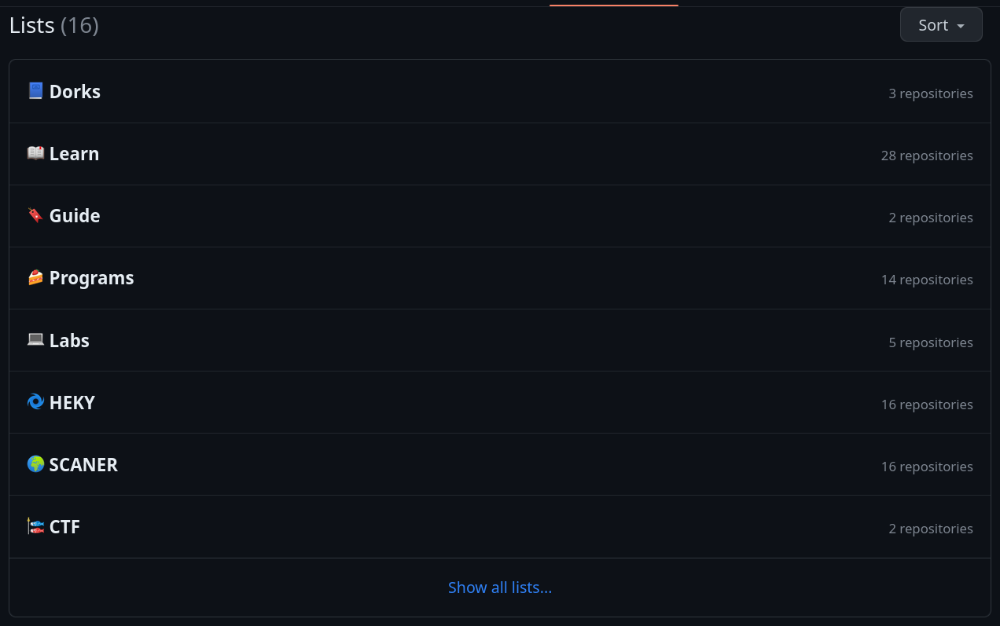

# My resources to learn Ethical Hacking

Since I started my journey in the world of cybersecurity, I've been learning and improving my skills in this area. I've been asked a lot of times about the resources I used to learn ethical hacking, so I decided to create this post to share with you the resources I used to learn ethical hacking.

# Summary
- [Summary](#summary)
- [How to start?](#how-to-start)
- [Where to learn?](#where-to-learn)
  - [CTFs](#ctfs)
  - [Blogs](#blogs)
  - [Github repositories](#github-repositories)
- [Tools](#tools)
- [Being up to date](#being-up-to-date)

# How to start?

The answer to this question is simple: you just need to start. I know that it is not easy to start learning ethical hacking because there are a lot of topics to learn, but you just need to start. You don't need to know everything to start learning ethical hacking; you just need to know the basics of the following topics:

- Networking
- Linux
- Programming
- Web development
- Databases

In my case, I graduated in Computer Science, so I already had a good knowledge of these topics. It is not necessary to have a degree in Computer Science to learn ethical hacking; you just need to have the interest and the motivation to learn.

# Where to learn?

Some popular resources for learning ethical hacking include online courses, tutorials, forums, and practice platforms. Online courses, such as those offered by Udemy, Coursera, and Pluralsight, provide structured learning paths and in-depth knowledge on various aspects of ethical hacking. These courses often include video lectures, quizzes, and hands-on exercises to help reinforce the concepts.

Additionally, there are numerous tutorials available on websites and YouTube channels dedicated to ethical hacking. These tutorials cover a wide range of topics, from basic concepts to advanced techniques. They often provide step-by-step instructions and demonstrations, making it easier for learners to follow along and understand the practical aspects of ethical hacking.

Forums and online communities focused on cybersecurity and ethical hacking, such as Reddit's r/Netsec and Hack Forums, serve as valuable resources for learning. These platforms allow individuals to ask questions, share knowledge, and engage in discussions with like-minded individuals. Participating in these communities can provide insights into real-world challenges and solutions, as well as networking opportunities with professionals in the field.

To gain hands-on experience and practice ethical hacking techniques, Capture the Flag (CTF) challenges are widely used. CTFs simulate real-world scenarios and require participants to find vulnerabilities, exploit systems, and solve various security challenges. Several online platforms, such as Hack The Box, TryHackMe, and OverTheWire, offer CTF challenges of varying difficulty levels. These platforms provide a safe and legal environment for individuals to sharpen their hacking skills and learn new techniques.

Books also play an important role in learning ethical hacking, as they often provide comprehensive coverage of the subject matter. Some popular books in the field include "The Web Application Hacker's Handbook" by Dafydd Stuttard and Marcus Pinto, "Metasploit: The Penetration Tester's Guide" by David Kennedy, Jim O'Gorman, Devon Kearns, and Mati Aharoni, and "Hacking: The Art of Exploitation" by Jon Erickson. These books delve into the technical aspects of ethical hacking, explaining concepts, tools, and methodologies in detail.

Ultimately, the best approach to learning ethical hacking is often a combination of different resources. By exploring a variety of mediums, individuals can benefit from different teaching styles and gain a well-rounded understanding of the subject. It is essential to adapt the learning process to personal preferences and learning styles, allowing for a more engaging and effective educational experience.

## CTFs
In addition to the three common types of Capture the Flag (CTF) competitions mentioned—Jeopardy, Attack-Defence, and mixed—there are some key characteristics and considerations for each type.

Jeopardy-style CTFs are often popular because they encompass a wide range of categories, allowing participants to showcase their skills in various areas of information security. These categories can include web security, forensics, cryptography, binary exploitation, reverse engineering, network security, and more. Each task within a category typically has a specific point value associated with it, with more complex tasks offering higher points. Participants solve these tasks independently or as a team, and the points earned contribute to their overall score. Jeopardy-style CTFs often require a combination of technical knowledge, analytical thinking, and problem-solving skills.

Attack-Defence CTFs offer a different dynamic. Each team has their own network or host with vulnerable services. The objective is to secure your own services while attempting to exploit and capture flags from the opposing teams. Flags are typically hidden within the services, and capturing a flag from an opponent's service earns points for the capturing team. However, opponents can patch their services to prevent further exploitation. This type of CTF requires both offensive and defensive skills, as participants must continuously monitor and protect their own services while actively seeking vulnerabilities in the opponent's services.

Mixed CTFs combine elements from both Jeopardy-style and Attack-Defence competitions. They include a mix of tasks from different categories, similar to Jeopardy-style CTFs, but may also incorporate elements of network exploitation and defense. This hybrid format allows participants to demonstrate their proficiency in various areas, ranging from solving challenging puzzles to exploiting vulnerable systems.

CTFs provide an engaging and competitive environment for individuals and teams to showcase their technical skills, creativity, and problem-solving abilities. They simulate real-world scenarios, enabling participants to gain hands-on experience and exposure to various challenges they may encounter in the field of information security.

This is a list of CTF platforms that I recommend you to try:

- [TryHackMe](https://tryhackme.com/)
- [HackTheBox](https://www.hackthebox.eu/)
- [PicoCTF](https://picoctf.org/)
- [OverTheWire](https://overthewire.org/wargames/)
- [Root-Me](https://www.root-me.org/?lang=en)
- [VulnHub](https://www.vulnhub.com/)

This is a great article about CTFs: [CTF Field Guide](https://trailofbits.github.io/ctf/). You also can read other articles about CTFs like [this](https://jaimelightfoot.com/blog/so-you-want-to-ctf-a-beginners-guide/)

## Blogs
My favorite learning method is by reading blog posts and testing the things. In most scenarios, I read a blog post, and then I try to reproduce the things that I learned. Here are some blogs that I recommend you read:

- [exploit-notes](https://exploit-notes.hdks.org/)
- [swisskyrepo](https://swisskyrepo.github.io/)
- [viperone](https://viperone.gitbook.io/pentest-everything/)
- [HackTricks](https://book.hacktricks.xyz/)
- [0x00sec](https://0x00sec.org/)
- [7h3w4lk3rs-organization](https://7h3w4lk3rs-organization.gitbook.io/the-hive/)

I found a repository on GitHub with a lot of bookmarks related to cybersecurity. You can find it [here](https://github.com/kargisimos/offensive-bookmarks).

Other blog posts that I recommend you read are 0x00sec's [Tricks of the trade from 5 years in offensive cyber security](https://0x00sec.org/t/tricks-of-the-trade-from-5-years-in-offensive-cyber-security/15794) and Ropnop's [Docker for pentesters](https://blog.ropnop.com/docker-for-pentesters/).

## Github repositories
GitHub is a great place to find resources to learn ethical hacking. In my GitHub account, I have a lot of repositories with resources to learn ethical hacking. You can find them [here](https://github.com/h4ndsh?tab=stars). 

# Tools
There are a lot of tools to learn ethical hacking and to do pentesting. Here are some tools that you can start with:
- [offsec tools](https://offsec.tools/)

# Being up to date

The world of cybersecurity is constantly changing, so it's important to be up to date. If you are interested in cybersecurity, I recommend you follow some cybersecurity accounts on Twitter and read some cybersecurity news websites. It is also important to read the CVEs (Common Vulnerabilities and Exposures) to know the latest vulnerabilities that are being discovered.
Above all, it is important to practice and be curious because the best way to learn is by doing it.

- [CVEs](https://cve.mitre.org/)
- [cvetrends](https://cvetrends.com/)
- [zerodayinitiative](https://www.zerodayinitiative.com/advisories/published/)

Happy hacking! :smile:
