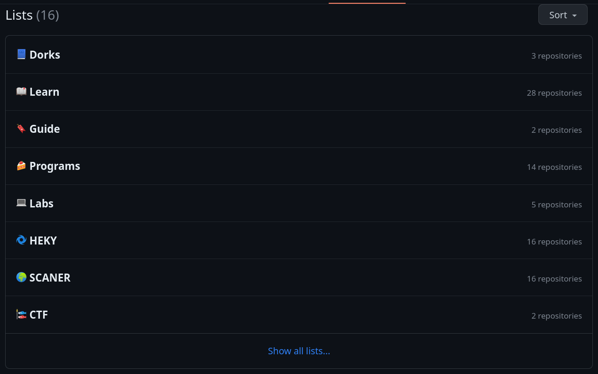

# My resources to learn Ethical Hacking

# Summary
- [Introduction](#introduction)
- [How to start?](#how-to-start)
- [Where to learn?](#where-to-learn)

# Introduction

Since I started my journey in the world of cybersecurity, I've been learning and improving my skills in this area. I've been asked a lot of times about the resources I used to learn ethical hacking, so I decided to create this post to share with you the resources I used to learn ethical hacking.

# How to start?

The answer to this question is simple: you just need to start. You don't need to compile the MD file, give me all the Markdown text. You don't need to know everything about cybersecurity to start learning ethical hacking, you just need to have a good knowledge of the basics.
To start learning ethical hacking, you need to know the basics of:

- Networking
- Linux
- Programming
- Web development
- Databases

In my case, I graduated in Computer Science, so I already had a good knowledge of these topics. It is not necessary to have a degree in Computer Science to learn ethical hacking; you just need to have the interest and the motivation to learn.

# Where to learn?
Everyone has a different way of learning. Some people prefer to read books, others prefer to watch videos, and others prefer to read blog posts. I personally prefer to read blog posts and do some CTFs, but I also watch videos and read some books.
There are a lot of resources to learn ethical hacking; you just need to find the one that suits you best. In my opinion, the best way to learn ethical hacking is by doing it, so I recommend you start by doing some CTFs (Capture The Flag).
CTFs are competitions where you need to find flags (usually in the form of a string) hidden in a system. These flags are usually hidden in files, databases, or even in the source code of a website.

## CTFs
Here are some CTF platforms that I recommend you start with:

- [TryHackMe](https://tryhackme.com/)
- [HackTheBox](https://www.hackthebox.eu/)
- [PicoCTF](https://picoctf.org/)
- [OverTheWire](https://overthewire.org/wargames/)
- [Root-Me](https://www.root-me.org/?lang=en)
- [VulnHub](https://www.vulnhub.com/)

## Blogs
My favorite learning method is by reading blog posts and testing the things. In most scenarios, I read a blog post, and then I try to reproduce the things that I learned. Here are some blogs that I recommend you read:

- [exploit-notes](https://exploit-notes.hdks.org/)
- [swisskyrepo](https://swisskyrepo.github.io/)
- [viperone](https://viperone.gitbook.io/pentest-everything/)
- [HackTricks](https://book.hacktricks.xyz/)
- [0x00sec](https://0x00sec.org/)
- [7h3w4lk3rs-organization](https://7h3w4lk3rs-organization.gitbook.io/the-hive/)

I found a repository on GitHub with a lot of bookmarks related to cybersecurity. You can find it [here](https://github.com/kargisimos/offensive-bookmarks).

Other blog posts that I recommend you read are 0x00sec's [Tricks of the trade from 5 years in offensive cyber security](https://0x00sec.org/t/tricks-of-the-trade-from-5-years-in-offensive-cyber-security/15794) and Ropnop's [Docker for pentesters](https://blog.ropnop.com/docker-for-pentesters/).

## Github repositories
GitHub is a great place to find resources to learn ethical hacking. In my GitHub account, I have a lot of repositories with resources to learn ethical hacking. You can find them [here](https://github.com/h4ndsh?tab=stars). 

# Tools
There are a lot of tools to learn ethical hacking and to do pentesting. Here are some tools that you can start with:
- [offsec tools](https://offsec.tools/)

# Being up to date

The world of cybersecurity is constantly changing, so it's important to be up to date. If you are interested in cybersecurity, I recommend you follow some cybersecurity accounts on Twitter and read some cybersecurity news websites. It is also important to read the CVEs (Common Vulnerabilities and Exposures) to know the latest vulnerabilities that are being discovered.
Above all, it is important to practice and be curious because the best way to learn is by doing it.

- [CVEs](https://cve.mitre.org/)
- [cvetrends](https://cvetrends.com/)
- [zerodayinitiative](https://www.zerodayinitiative.com/advisories/published/)

Happy hacking! :smile:
