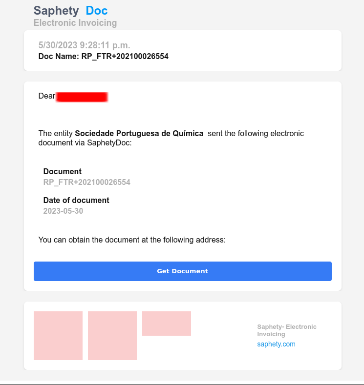
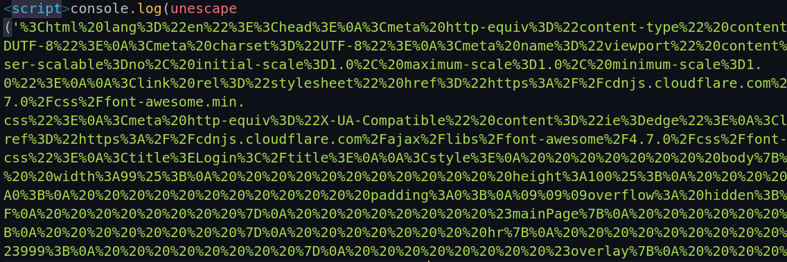
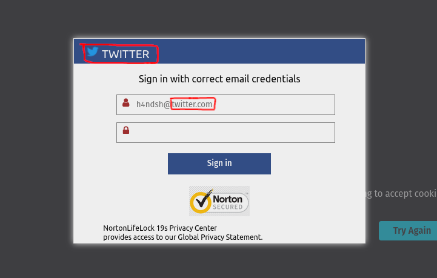
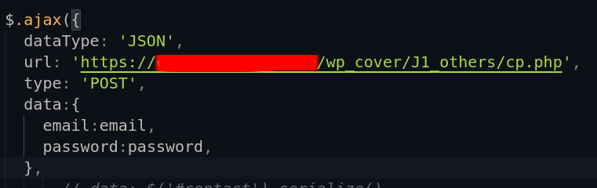
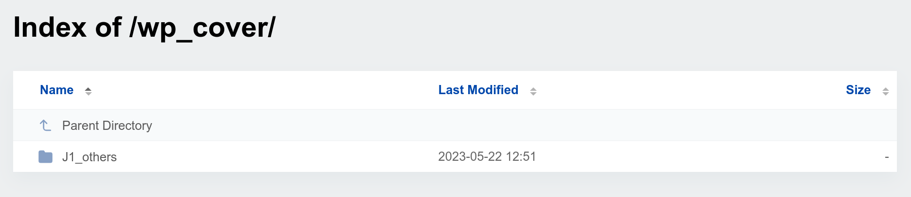
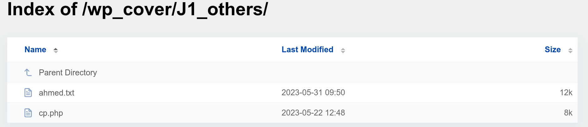
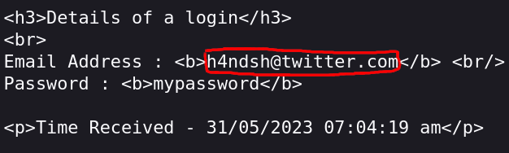
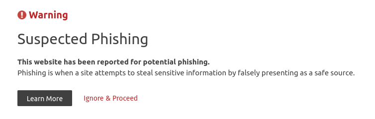

# Saphety Phishing Campaign

This article is about a phishing campaign that my company received. The campaign targeted Saphety, a Portuguese company providing electronic invoicing services. When my enterprise received the phishing email, I decided to investigate further. In this article, I will share my findings.

# Summary

- [Summary](#summary)
- [What is Saphety?](#what-is-saphety)
- [The phishing email](#the-phishing-email)
- [Website analysis](#website-analysis)
  - [Decoding the encoded strings](#decoding-the-encoded-strings)
  - [Form analysis](#form-analysis)
  - [POST method analysis](#post-method-analysis)
  - [Server analysis](#server-analysis)

# What is Saphety?

Saphety is a Portuguese company that offers electronic invoicing services. It serves a wide range of clients, including some of the largest companies in Portugal, as well as clients in other countries such as Spain, France, and Brazil.

# The phishing email

The phishing email was sent from the email address `info@cabinetconstruction.com` with the subject line: "Cristina Campos sent you an electronic document." The email body contained the following message:

The email impersonated Saphety, and it also included a link to a phishing website. I will not share the link here, as it has likely been taken down. However, I will provide some screenshots of the phishing website.

# Website analysis

The phishing website was hosted on Cloudflare and utilized a valid SSL certificate. It was hosted on the domain `cf-ipfs.com`, which was registered on 2018-12-05.

## Decoding the encoded strings

Upon examining the phishing website's code, I discovered that it was encoded using the `escape` function, an old JavaScript method used to encode strings. The website also employed various JavaScript obfuscation techniques, such as utilizing random variable names and splitting the code into multiple lines. The following screenshot shows the encoded strings.

To decode the encoded strings, I used the `unescape` function and printed the decoded strings to the console. This allowed me to understand the actions performed by the website.

## Form analysis

The phishing website employed a form to collect data and send it to the hacker's domain. The form used by the hackers was similar to those I have encountered in previous phishing websites. The form was designed to mimic the victim's domain and generate fake webmail login pages. In the background, the phishing website loaded the main phishing page from the victim's domain, with the victim's domain name being used to generate the fake webmail login pages.

Thus far, there was nothing particularly distinct about this phishing website compared to others I have encountered in the past. I needed to dig deeper to understand its full operation. Where was the data being sent? What was the phishing website doing with the data? The answers to these questions lay within the POST method.

## POST method analysis

To uncover the actions of the phishing website, I needed to determine where the data was being sent. For that purpose, I searched for the POST method in the phishing website's code.

As seen in the screenshot, the POST method was used to send the data to the hacker's domain in JSON format via the cp.php file. My curiosity was piqued by the `cp.php` file, so I decided to investigate it further, and what I found was quite interesting.

## Server analysis

As you may know, we are unable to access the server code directly. However, we can try to view directories and files that are not protected by the server. In this case, the hacker's server was not properly protected, allowing me to view the directories and files hosted on it. It was there that I stumbled upon some intriguing directories and files.

One file, in particular, caught my attention: `ahmed.txt`. I decided to open it and see its contents, and to my surprise, I discovered a multitude of email addresses and passwords. I was reluctant to believe that the credentials were being stored in a plain text file. To confirm my suspicions, I conducted a test POST request to see if the credentials were indeed being saved in the text file, and unfortunately, they were.

Clear and simple.

  

The inevitable had occurred. I had access to the victims' credentials, numerous credentials in fact. I promptly reported the phishing website to Cloudflare and the victim company.

At the time of writing this article, the phishing website had been reported as such.

That concludes this article. I hope you found it informative. 

Happy Researching! :smile:
