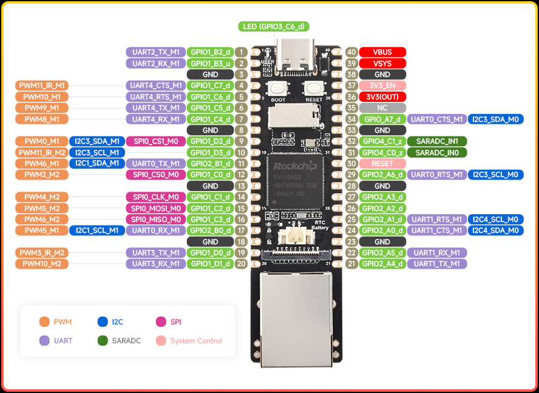

# DIY LAN Turtle - Building a Stealth Remote Access Device 🔒


In this post, I share my experience building a DIY stealth remote access device using the Luckfox Pico Max RV1106. Inspired by the commercial LAN Turtle but seeking a more affordable solution, I created this device to enable secure remote network access without complex port forwarding or traditional VPN setups. This project served as both a practical solution and a valuable learning experience in hardware integration and network security.


# Introduction

My need was simple: I wanted reliable remote access to local networks without the hassle of router configuration or complex VPN server setups. While the commercial [LAN Turtle](https://shop.hak5.org/products/lan-turtle) offers these capabilities, its premium price point led me to explore building my own solution. This project became an opportunity to not only create a cost-effective alternative but also to deepen my understanding of the underlying technologies.

# Hardware Selection 🛠️

After researching various options, I chose the [Luckfox Pico Max RV1106](https://www.luckfox.com/EN-Luckfox-Pico-Max) as the core of my project. This compact device offers an impressive set of features at a remarkably affordable price point.

## Specifications

| **Component**         | **Details**                                                                 |
|-----------------------|-----------------------------------------------------------------------------|
| **Processor**         | Cortex A7 @ 1.2GHz                                                         |
| **NPU**               | **Pro:** 0.5 TOPS, supports int4, int8, and int16                         |
|                       | **Max:** 1 TOPS, supports int4, int8, and int16                           |
| **ISP**               | Input 5M @30fps (Max)                                                     |
| **Memory**            | **Pro:** 128MB DDR2                                                       |
|                       | **Max:** 256MB DDR2                                                       |
| **USB**               | USB 2.0 Host/Device                                                       |
| **Camera**            | MIPI CSI 2-lane                                                           |
| **GPIO**              | 26 × GPIO pins                                                            |
| **Ethernet Port**     | 10/100M Ethernet controller and embedded PHY                              |
| **Default Storage**   | SPI NAND FLASH (256MB)                                                    |

While it lacks some features I would have liked (PoE and Gigabit Ethernet), the price-to-performance ratio made it an excellent choice for my project.



## 🛍️ Shopping List

Here's what I needed for this project:
- [Luckfox Pico Max RV1106](https://www.luckfox.com/EN-Luckfox-Pico-Max) - €18
- 64GB microSD card - €10
- microSD to USB adapter - €2

## Alternative Hardware Options 

For those interested in trying different hardware, here are some alternatives I considered:

- [Raspberry Pi Zero W](https://www.raspberrypi.org/products/raspberry-pi-zero-w/) + USB Ethernet
- [Orange Pi Zero 3](http://www.orangepi.org/html/hardWare/computerAndMicrocontrollers/details/Orange-Pi-Zero-3.html)
- [GL.iNet GL-MT300N V2](https://www.gl-inet.com/products/gl-mt300n-v2/)

# 🚀 Implementation 

I performed all testing on Linux. Here's how I put everything together:

## Setting Up the SDK

First, I prepared my development environment:

```bash
sudo apt update

sudo apt-get install -y git ssh make gcc gcc-multilib g++-multilib module-assistant expect g++ gawk texinfo libssl-dev bison flex fakeroot cmake unzip gperf autoconf device-tree-compiler libncurses5-dev pkg-config bc python-is-python3 passwd openssl openssh-server openssh-client vim file cpio rsync
```

```bash
git clone https://github.com/LuckfoxTECH/luckfox-pico.git
cd luckfox-pico
./build.sh lunch
```

In the lunch script, I selected:
- RV1106 board [6]
- SD Card boot [0]
- Ubuntu OS [1]

## Building the Operating System ⚙️

I discovered that the default kernel needed modification to support the VPN service. Here's how I enabled the required UTS namespace:

```bash
./build.sh kernelconfig
```

I navigated to:
```bash
-> General setup
-> Namespaces support (NAMESPACES [=Y])  
[*] UTS namespace (NEW) 
```

After saving the configuration and building the kernel, the output files were stored in `luckfox-pico/output/image/`.

## 📀 OS Installation 

I've shared my compiled files [here](./image.tar.xz). To extract them:
```bash
tar -xvf image.tar.xz
```

For installation, I used a Windows VM and the `SocToolKit` software from the SDK (`luckfox-pico/tools/windows/SocToolKit`). The process was straightforward - just selecting the compiled image files and target microSD card. The [official documentation](https://wiki.luckfox.com/Luckfox-Pico/Luckfox-Pico-quick-start/SD-Card-burn-image) provides detailed instructions if needed.

## VPN Setup


For remote access, I chose [Twingate](https://www.twingate.com) because of its excellent free tier that perfectly suited my needs.

1. Created a Twingate account
2. Created a new Network [(Network > Remote Networks > + Remote Network - select "other")](https://h4ndsh.twingate.com/networks?sortBy=name)
3. Added a Connector (Network > "network name" > + Add Connector)
4. Installed the Connector on my Luckfox Pico ("Inside Connector" > Linux > Generate Tokens > Copy Command)
5. SSH'd into the Luckfox Pico and ran:

```bash
curl "https://binaries.twingate.com/connector/setup.sh" | sudo TWINGATE_ACCESS_TOKEN="" TWINGATE_REFRESH_TOKEN="" TWINGATE_NETWORK="h4ndsh" TWINGATE_LABEL_DEPLOYED_BY="linux" bash
```

## Client Setup

1. Installed the client:
```bash
curl -s https://binaries.twingate.com/client/linux/install.sh | sudo bash
```

2. Configured:
```bash
twingate setup
```

3. Started the service:
```bash
twingate start
```

## Resources Configuration

I added resources through the Twingate dashboard [(Network > Resources > + Resource)](https://h4ndsh.twingate.com/resources?sortBy=name)

# Testing the Setup

I started by adding SSH access to my Luckfox Pico as a resource. Then, I scanned my network for potential targets:

```bash
nmap -sn -Sv x.x.x.x/24
```

Additional resources like RDP or VNC can be added as needed.

# 3D Printed Case

To protect my device and make it more portable, I looked into printing a case. Here are the models I found most useful:

- [Thingiverse Model](https://www.thingiverse.com/thing:6670447)
- [Printables Model](https://www.printables.com/model/945919-luckfox-pico-promax-rv1106-case-pico-plusmini-rv11?lang=en)

# Future Improvements

Here's what I'm planning to add to my project:
- [ ] ESP32 integration
- [ ] Battery installation
- [ ] RTC implementation
- [ ] Penetration testing scripts
- [ ] Custom OS with ESP32, security tools, and testing scripts

</br>

<center>
  
</center>
