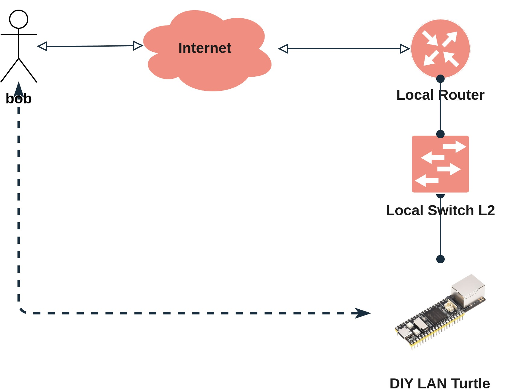
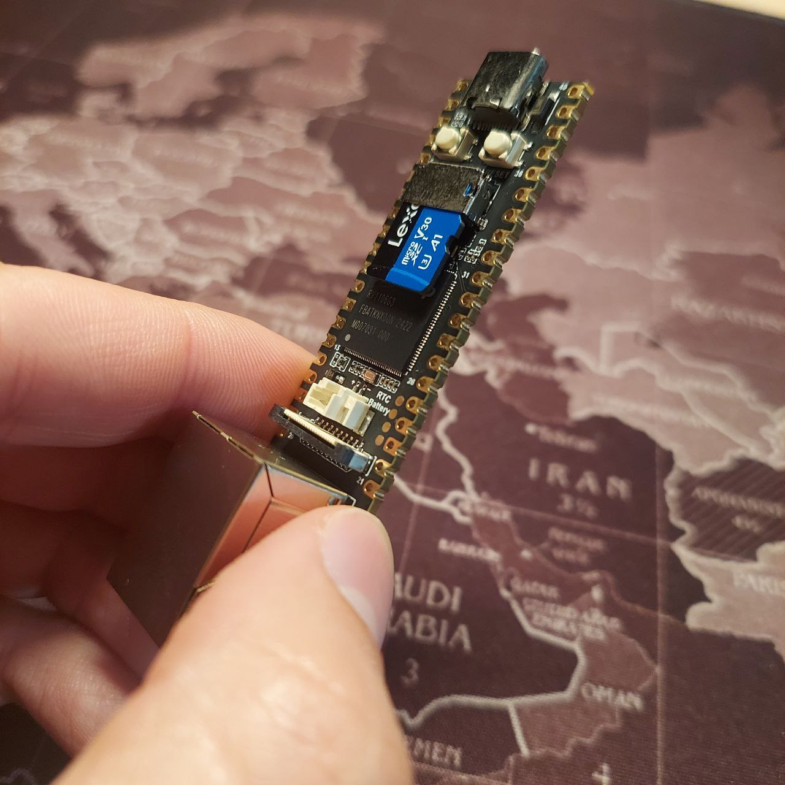

# DIY LAN Turtle - Building a Stealth Remote Access Device

In this post, I share my experience building a DIY stealth remote access device using the Luckfox Pico Max RV1106. Inspired by the commercial LAN Turtle but seeking a more affordable solution, I created this device to enable remote network access without complex port forwarding or traditional VPN setups. This project served as both a practical solution and a valuable learning experience in hardware integration and network security.


---
<center >
<h1>⚠️ WARNING ⚠️</h1>
<p style="font-weight: bold; color: #B85952">
This project uses free third-party services! And as the saying goes: <i>if it's free, you are the product!</i>
This is just an example of usage. My goal is not to connect to locations that could compromise sensitive information or infrastructure.
</p>
</center>

---


# Idea

My goal was simple: I wanted reliable remote access to local networks without the hassle of complex VPN setups or router configuration. Since I often don’t have access to the router, I needed a true plug-and-play solution. While the commercial LAN Turtle provides these capabilities, its high price pushed me to explore a more cost-effective alternative. This project became an opportunity not just to build my own solution, but also to gain a deeper understanding of the underlying technologies.

<center>
  
</center>

# Hardware Selection


After researching various options, I chose the [Luckfox Pico Max RV1106](https://www.luckfox.com/EN-Luckfox-Pico-Max) as the core of my project. This compact device offers an impressive set of features at a remarkably affordable price point.


<center>
  
</center>

## Specifications

| **Component**         | **Details**                                                                 |
|-----------------------|-----------------------------------------------------------------------------|
| **Processor**         | Cortex A7 @ 1.2GHz                                                         |
| **NPU**               | **Max:** 1 TOPS, supports int4, int8, and int16                           |
| **ISP**               | Input 5M @30fps (Max)                                                     |
| **Memory**            | **Max:** 256MB DDR2                                                       |
| **USB**               | USB 2.0 Host/Device                                                       |
| **Camera**            | MIPI CSI 2-lane                                                           |
| **GPIO**              | 26 × GPIO pins                                                            |
| **Ethernet Port**     | 10/100M Ethernet controller and embedded PHY                              |
| **Default Storage**   | SPI NAND FLASH (256MB)                                                    |

While it lacks some features I would have liked (PoE and Gigabit Ethernet), the price-to-performance ratio made it an excellent choice for my project.


## Alternative Hardware Options 

For those interested in trying different hardware, here are some alternatives I considered:

- [Raspberry Pi Zero W](https://www.raspberrypi.org/products/raspberry-pi-zero-w/) + USB Ethernet
- [Orange Pi Zero 3](http://www.orangepi.org/html/hardWare/computerAndMicrocontrollers/details/Orange-Pi-Zero-3.html)
- [GL.iNet GL-MT300N V2](https://www.gl-inet.com/products/gl-mt300n-v2/)
- [ESP32-S3 ¿¿Maybe??](https://www.hackster.io/news/running-linux-on-an-esp32-s3-0d96c5a24081)
- [M5Stack LLM630](https://shop.m5stack.com/products/m5stack-llm630-compute-kit-ax630c?variant=45963339235585)

# 🛍️ Shopping List

Here's what I used for this project:
- [Luckfox Pico Max RV1106](https://www.luckfox.com/EN-Luckfox-Pico-Max) - €18
- 64GB microSD card - €10
- microSD to USB adapter - €2


<center>
  
</center>


# 🚀 Implementation Luckfox Pico

I performed all testing on Linux. Here's how I put everything together:

## Setting Up the SDK

First, I prepared my development environment:

```bash
sudo apt update

sudo apt-get install -y git ssh make gcc gcc-multilib g++-multilib module-assistant expect g++ gawk texinfo libssl-dev bison flex fakeroot cmake unzip gperf autoconf device-tree-compiler libncurses5-dev pkg-config bc python-is-python3 passwd openssl openssh-server openssh-client vim file cpio rsync
```

```bash
git clone https://github.com/LuckfoxTECH/luckfox-pico.git
cd luckfox-pico
./build.sh lunch
```

In the lunch script, I selected:
- RV1106 board [6]
- SD Card boot [0]
- Ubuntu OS [1]

## Building the Operating System

After several attempts, I discovered that the third-party VPN required the UTS namespace to be enabled in the kernel. Here’s how I activated it:

```bash
./build.sh kernelconfig
```

I navigated to:
```bash
-> General setup
-> Namespaces support (NAMESPACES [=Y])  
[*] UTS namespace (NEW) 
```

After saving the configuration and building the kernel, the output files were stored in `luckfox-pico/output/image/`.

## Luckfox Pico OS Installation 

For installation, I used a Windows VM and the `SocToolKit` software from the SDK (`luckfox-pico/tools/windows/SocToolKit`). The process was straightforward - just selecting the compiled image files and target microSD card. The [official documentation](https://wiki.luckfox.com/Luckfox-Pico/Luckfox-Pico-quick-start/SD-Card-burn-image) provides detailed instructions if needed.


## VPN Setup


For remote access, I chose [Twingate](https://www.twingate.com) for its excellent free tier, which perfectly suited my needs. Since I had never used it before, I decided to try it for this project. Alternatives like [OpenZiti](https://openziti.io/) and [Tailscale](https://tailscale.com/) also offer great solutions, but Twingate stood out for its simplicity and ease of setup.


1. Created a Twingate account
2. Created a new Network [(Network > Remote Networks > + Remote Network - select "other")](https://<name>.twingate.com/networks?sortBy=name)
3. Added a Connector (Network > "network name" > + Add Connector)
4. Installed the Connector on my Luckfox Pico ("Inside Connector" > Linux > Generate Tokens > Copy Command)
5. SSH'd into the Luckfox Pico and run:

```bash
curl "https://binaries.twingate.com/connector/setup.sh" | sudo TWINGATE_ACCESS_TOKEN="" TWINGATE_REFRESH_TOKEN="" TWINGATE_NETWORK="<name>" TWINGATE_LABEL_DEPLOYED_BY="linux" bash
```

## Twingate Client Setup

> Installed the client:
> ```bash
> curl -s https://binaries.twingate.com/client/linux/install.sh | sudo bash
> ```

> Configured:
> ```bash
> twingate setup
> ```

> Started the service:
> ```bash
> twingate start
> ```

## Resources Configuration

I added resources through the Twingate dashboard [(Network > Resources > + Resource)](https://<name>.twingate.com/resources?sortBy=name)

## Automatically Adding Resources

Since we don't always know the IP of the device we're connecting to, and we may not want to log into the third-party dashboard (Twingate) every time, I developed a script that uses the API to automatically add resources.

This script should run whenever the device connects to the network.

**1. Settings > API > Generate Token**  
**2. Replace the variables in the script accordingly.** 

```python
import json
import os
import socket
import time
from gql import gql, Client
from gql.transport.requests import RequestsHTTPTransport

# Twingate API settings
API_URL = "https://<name>.twingate.com/api/graphql/"
API_KEY = "api-token"
TARGET_NETWORK_NAME = "<network-name>"

# Path for the resources tracking file
RESOURCES_FILE = "/home/pico/scripts/resources.json"

# Function to check internet connectivity
def check_internet_connection(host="8.8.8.8", port=53, timeout=3):
    """
    Check if there is an internet connection by trying to connect to Google's DNS server.
    Returns True if connection is available, False otherwise.
    """
    try:
        socket.setdefaulttimeout(timeout)
        socket.socket(socket.AF_INET, socket.SOCK_STREAM).connect((host, port))
        return True
    except socket.error:
        return False

# Rest of your existing code remains the same
QUERY_REMOTE_NETWORKS = gql("""
query GetRemoteNetworkDetails {
  remoteNetworks(after: null, first: 10) {
    edges {
      node {
        id
        name
        connectors {
          edges {
            node {
              id
              name
              publicIP
              privateIPs
              remoteNetwork {
                id
                name
              }
            }
          }
        }
      }
    }
  }
}
""")

MUTATION_CREATE_RESOURCE = gql("""
mutation CreateResource($name: String!, $address: String!, $remoteNetworkId: ID!) {
  resourceCreate(
    name: $name,
    address: $address,
    remoteNetworkId: $remoteNetworkId
  ) {
    ok
    error
    entity {
      id
      name
      address {
        type
        value
      }
    }
  }
}
""")

def load_existing_resources():
    try:
        with open(RESOURCES_FILE, 'r') as f:
            resources = json.load(f)
            for r in resources:
                if 'remote_network_id' not in r:
                    r['remote_network_id'] = None 
            return resources
    except FileNotFoundError:
        return []

def save_resource(resource, remote_network_id):
    resources = load_existing_resources()
    resources.append({
        'id': resource['id'],
        'name': resource['name'],
        'address': resource['address']['value'],
        'remote_network_id': remote_network_id 
    })
    with open(RESOURCES_FILE, 'w') as f:
        json.dump(resources, f, indent=2)

def is_resource_exists(address, remote_network_id, existing_resources):
    return any(
        r['address'] == address 
        and r['remote_network_id'] == remote_network_id 
        for r in existing_resources
    )
    
def setup_client():
    transport = RequestsHTTPTransport(
        url=API_URL,
        headers={"X-API-KEY": API_KEY},
        use_json=True,
    )
    return Client(transport=transport, fetch_schema_from_transport=True)

def get_target_network(client):
    response = client.execute(QUERY_REMOTE_NETWORKS)
    for edge in response["remoteNetworks"]["edges"]:
        network = edge["node"]
        if network["name"] == TARGET_NETWORK_NAME:
            return network
    return None

def create_resource(client, name, address_value, remote_network_id):
    params = {
        "name": name,
        "address": address_value,
        "remoteNetworkId": remote_network_id
    }
    response = client.execute(MUTATION_CREATE_RESOURCE, variable_values=params)
    if not response["resourceCreate"]["ok"]:
        raise Exception(f"Failed to create resource: {response['resourceCreate']['error']}")
    return response["resourceCreate"]["entity"]

def automate_resource_creation():
    client = setup_client()
    existing_resources = load_existing_resources()

    print(f"Searching for target network: {TARGET_NETWORK_NAME}...")
    target_network = get_target_network(client)

    if not target_network:
        print(f"Network '{TARGET_NETWORK_NAME}' not found.")
        return

    print(f"Found network: {target_network['name']}")
    remote_network_id = target_network['id']

    for connector_edge in target_network["connectors"]["edges"]:
        connector = connector_edge["node"]
        public_ip = connector.get("publicIP")
        private_ips = connector.get("privateIPs", [])

        if public_ip and not is_resource_exists(public_ip, remote_network_id, existing_resources):
            resource_name = f"Resource-Public-{public_ip.replace('.', '-')}"
            resource = create_resource(client, resource_name, public_ip, remote_network_id)
            save_resource(resource, remote_network_id)  # Passa o network_id

        for private_ip in private_ips:
            if not is_resource_exists(private_ip, remote_network_id, existing_resources):
                resource_name = f"Resource-Private-{private_ip.replace('.', '-')}"
                resource = create_resource(client, resource_name, private_ip, remote_network_id)
                save_resource(resource, remote_network_id)  # Passa o network_id
                
if __name__ == "__main__":
    # Ensure directory exists
    os.makedirs(os.path.dirname(RESOURCES_FILE), exist_ok=True)
    
    # Wait for internet connection
    while not check_internet_connection():
        time.sleep(30)  # Wait 30 seconds before trying again
    
    print("Internet connection established. Starting resource creation...")
    
    try:
        automate_resource_creation()
    except Exception as e:
        print(f"Error: {e}")

```

**3. Running at Startup**

To run the script at startup, I added the following entry to crontab:

```bash
@reboot /usr/bin/python3 /home/pico/scripts/twingate-updater.py >> /home/pico/scripts/twingate-updater.log 2>&1
```

If necessary, adjust the file and log paths accordingly.

**4. Testing**

To verify that everything is working correctly, I simply restart the device and check if new resources have been created in Twingate. I then log in to the Twingate website to confirm the new resources.

In my case, three new resources were created:

- LAN network IP (connected to the AP): 172.16.0.91
- USB connection IP: 172.32.0.70
- Public IP: xxx.xxx.xxx.xxx


**5. Resource Permissions**

With these resources added, I can grant access to either everyone or specific groups. In my case, I assigned the resource to "Everybody."

To verify permissions, I use the Twingate CLI on my host machine:

```bash
twingate resources
```

**6. TCP and UDP Port Permissions**

It is also possible to allow or restrict specific ports for each resource. By default, all ports are open (*).

**7. Testing the Connection**

Once outside the network, I can test the connection by running:

```bash
twingate start
ssh pico@172.16.0.91
```

This establishes a remote connection to the device.

# Testing the Setup

I started by adding SSH access to my Luckfox Pico as a resource. Then, I scanned my network for potential targets:

```bash
nmap -sn -Sv 172.16.0.0/24
```

Once I identified available ports, I manually added specific resources to Twingate. For example, if I found a device at 172.16.0.80 with port 80 open, I could add it as a resource. After that, I could access the device through my browser as if I were inside the network.

# 3D Printed Case

To protect my device and make it more portable, I looked into printing a case. Here are the models I found most useful:

- [Thingiverse Model](https://www.thingiverse.com/thing:6670447)
- [Printables Model](https://www.printables.com/model/945919-luckfox-pico-promax-rv1106-case-pico-plusmini-rv11?lang=en)

<center>
  
</center>

# How to Use?
**It's super simple! I just plug the hardware into the Ethernet port, power it with a power bank, a DC adapter, or whatever nearby USB port happens to offer 5V and voilà!**


<center>
  
</center>

</br>


# Future Improvements

Here's what I'm planning to add to my project:
- [ ] ESP32 integration (ESP-Hosted)
- [ ] Battery installation
- [ ] RTC implementation
- [ ] Penetration testing scripts
- [ ] Custom OS with ESP32, security tools, and testing scripts

